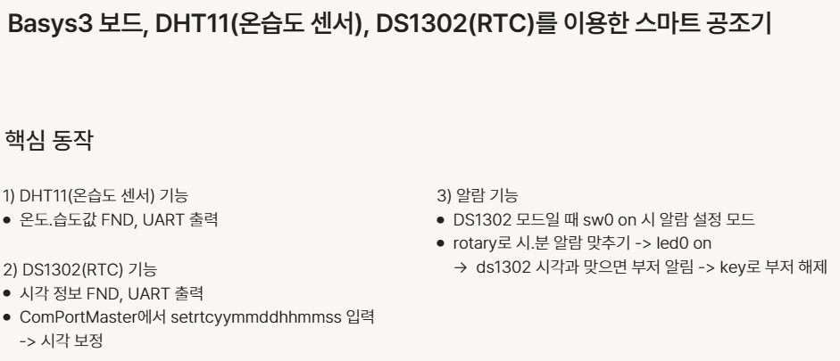
## Block Diagram
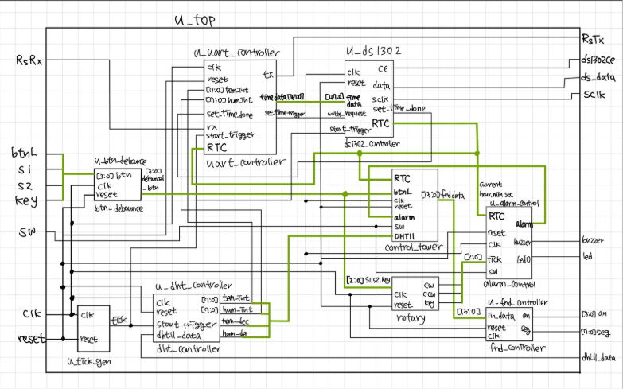
## FSM
### dht11
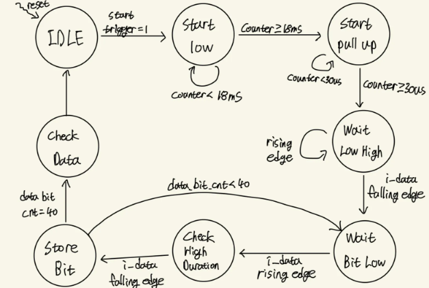
### ds1302
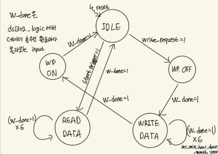
### ds1302_logic
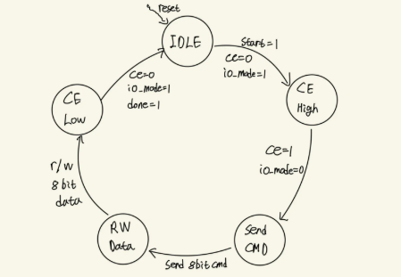
## Test bench
### dht11
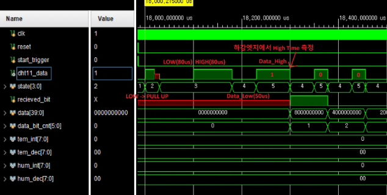
### ds1302
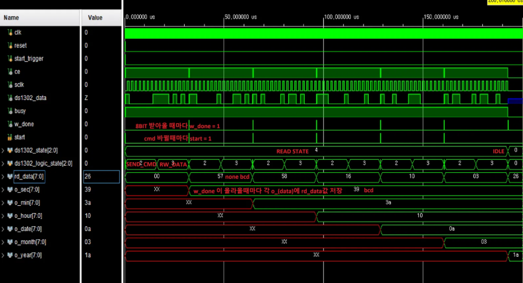
### uart_receiver
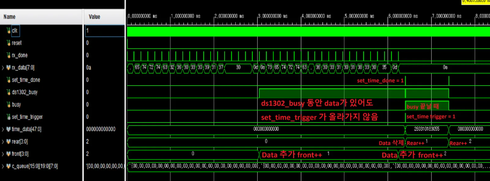
## Oscilloscope Analyze
### dht11

### ds1302
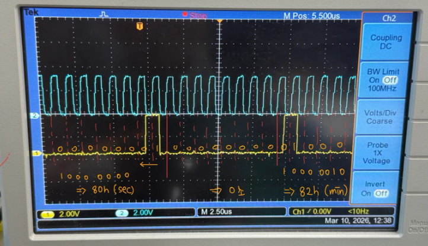
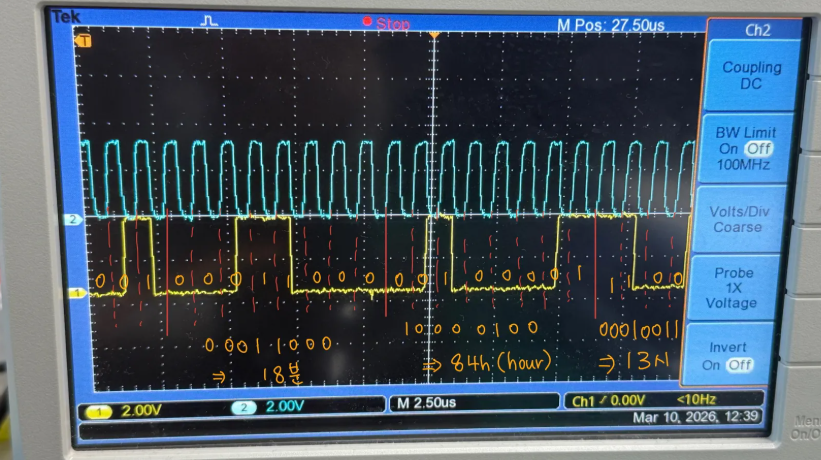
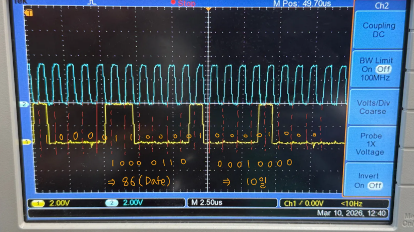
## Conclusion
- Bolck Diagram, FSM 구성을 먼저 하는것이 프로젝트 규모가 클수록 필수적이라는 것을 느꼈다.
- 동작이 안될 때 디버깅의 방법으로 test bench를 가장 먼저 짜보고, 각 reg들의 값을 보는 방법이 코드의 어떤 부분에서 잘못되었는지 확인하기 편했다.
- test bench의 작동도 잘된다면 oscilloscope로 측정하는 것도 필수적이었다. 하드웨어 문제가 생각보다 잦았다.
- time_out, pysical issue 등 에러 발생 가능 부분을 잡아놓고 시간 관계상 error 처리를 하지 못했다.
- (개선점) 여러 error를 error controller에 모아 특정 동작을 구현한다.
